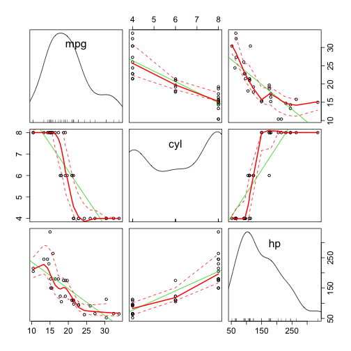

Data Products Project
========================================================
Author: BM
date: 8/6/2016
autosize: true

Exploring mtcars data 
========================================================
This project is using mtcars data to showcase the shinyapps capability. There are three tabs provided:

- exploring mtcars data
- scatter plot presentation between mpg, cyl, hp
- about

========================================================
Sample Data

```r
head(mtcars)
```

```
                   mpg cyl disp  hp drat    wt  qsec vs am gear carb
Mazda RX4         21.0   6  160 110 3.90 2.620 16.46  0  1    4    4
Mazda RX4 Wag     21.0   6  160 110 3.90 2.875 17.02  0  1    4    4
Datsun 710        22.8   4  108  93 3.85 2.320 18.61  1  1    4    1
Hornet 4 Drive    21.4   6  258 110 3.08 3.215 19.44  1  0    3    1
Hornet Sportabout 18.7   8  360 175 3.15 3.440 17.02  0  0    3    2
Valiant           18.1   6  225 105 2.76 3.460 20.22  1  0    3    1
```

Slide With Plot exploring the relationship betwen mpg, cycl and hp
========================================================



Car is data is provided by motor trend magazine
========================================================

The data was extracted from the 1974 Motor Trend US magazine, and comprises fuel consumption and 10 aspects of automobile design and performance for 32 automobiles (1973 - 1974 models). 

[Source: https://stat.ethz.ch/R-manual/R-devel/library/datasets/html/mtcars.html](https://stat.ethz.ch/R-manual/R-devel/library/datasets/html/mtcars.html)
